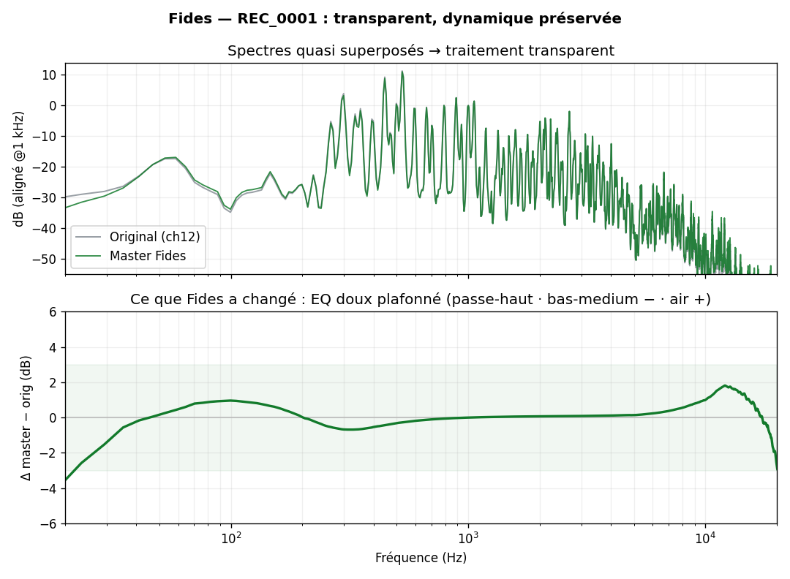

# Fides

[](https://github.com/decarvalhoe/fides/actions/workflows/ci.yml)
[](LICENSE)


Auto‑mastering **transparent** pour **violon solo et petites formations classiques**
(quatuor à cordes, musique de chambre). Le logiciel analyse l'enregistrement, décide
une chaîne de traitement minimale et soustractive, l'applique, puis **prouve** sa
transparence (null‑test, A/B, mesures EBU R128). Objectif : *capitaliser sur les
meilleures pratiques studio sans dénaturer le son original.*

> Pile hybride open‑source / local (cf. [`RESEARCH.md`](RESEARCH.md)) :
> **pedalboard** (DSP) · **pyloudnorm**/**ffmpeg‑normalize** (loudness EBU R128) ·
> **matchering** (matching sur référence, optionnel) · IR de vraies salles **OpenAIR**.
> Runtime : **WSL2 / Ubuntu** (Linux‑first ; GPU NVIDIA dispo mais non requis).



## Philosophie « ne pas dénaturer »

- Traitement **minimal, soustractif, plafonné** (chaque correction est bornée).
- **Aucun débruiteur IA orienté voix** (DeepFilterNet, etc.) : ils détruisent le timbre
  des cordes (preuves dans `RESEARCH.md`). Le débruitage est **classique** et **opt‑in**.
- **Loudness par gain linéaire** plafonné true‑peak → **dynamique (LRA) intacte**.
- **Garde‑fous fournis à chaque rendu** : `null_residual.wav` (ce qui a été ajouté/retiré),
  `_pre_master.wav` (nettoyé sans loudness, pour l'A/B), rapport détaillé des décisions.

## Architecture (pipeline)

```
Ingest/Repair → Analyze → Plan → Process → Verify → Output
   io_wav        analyze    plan    process   verify   report
   lecture       stats/     chaîne  HP·dehum  LUFS/    master + stems
   tolérante     rôles/     + params ·EQ·     true-pk  + null + report
   (tronqué)     bruit/clip          loudness null-test (json/md)
```

| Module | Rôle |
|---|---|
| `fides/io_wav.py` | Lecture multicanal 24‑bit robuste (fichiers à en‑tête **tronqué**), repair RIFF, écriture |
| `fides/io_util.py` | Chargement multi‑formats (soundfile + repli **ffmpeg** pour M4A/AAC…) |
| `fides/analyze.py` | Stats/canal, classification (actif/silence/**duplicata**), bruit, **clip**, hum 50 Hz, tonal |
| `fides/plan.py` | Décide la chaîne + paramètres (plafonnés) depuis l'analyse + profil |
| `fides/process.py` | DC, déclip, de‑hum (notch), débruitage doux (opt‑in), EQ (pedalboard), loudness |
| `fides/reference.py` | Profils JSON + matching sur référence (matchering, optionnel) |
| `fides/verify.py` | Mesures LUFS/true‑peak (pyloudnorm) + **null‑test** |
| `fides/report.py` | Rapport JSON + Markdown |
| `fides/batch.py` | Traitement par lot + normalisation **album/anchor** (EBU R128 s2) |
| `fides/debleed.py` | De‑bleed **expérimental** via Demucs (palier 2, ensembles) |
| `fides/pipeline.py` / `cli.py` | Orchestration + CLI |

## Installation

Pré‑requis : Python ≥ 3.9 et **ffmpeg** dans le PATH (Linux/WSL2 recommandé ; macOS OK).

```bash
git clone https://github.com/decarvalhoe/fides.git
cd fides
python -m venv .venv && source .venv/bin/activate
pip install -e ".[match]"        # + matchering ; ajoutez [debleed] pour Demucs (palier 2)
```

Astuce WSL : `scripts/provision.sh` crée un venv et installe toute la pile sans sudo.

## Usage

```bash
# traitement par défaut (transparent : pas de débruitage, loudness linéaire)
fides IN.wav -o OUT/ -p violin_solo

# options
python -m fides.cli IN.wav -o OUT/ \
    -p string_quartet \          # profil
    -t -18 \                     # cible LUFS (sinon valeur du profil)
    --denoise \                  # active le débruitage doux (off par défaut)
    --limit \                    # limiteur doux pour atteindre la cible (sinon gain linéaire)
    --ebu \                      # loudness via ffmpeg-normalize EBU R128 (peut compresser)
    --reference REF.wav \        # matching sur une référence (matchering)
    --reverb 0.2 \               # réverbe d'espace (ou --ir hall|room|chamber, ou un chemin WAV)
    --deharsh --glue \           # de-harsh dynamique d'archet ; léger glue compressor
    --blend 5 --blend-gain -6 \  # multipiste : ajoute le canal 5 (ambiance) au master
    --no-stems

# mode batch (dossier de prises) + normalisation album/anchor
python -m fides.cli /chemin/prises -o OUT/ --batch -p string_quartet

# dry-run (analyse + plan, sans rendu) · liste des profils · entry point packagé
python -m fides.cli IN.wav -o OUT/ --dry-run
python -m fides.cli --list-profiles
pip install -e . && fides IN.wav -o OUT/        # commande `fides` après installation

# format plein : session COMPLÈTE multicanal traitée, 32-bit float, SR d'origine
fides IN.wav -o OUT/ --full                      # -> full_processed.wav (tous les canaux, float)
fides IN.wav -o OUT/ --bit-depth 32f             # master/stems en 32-bit float (sans perte)
```

**Interface graphique** (glisser‑déposer) : `fides-gui` — nécessite tkinter (Linux : `apt install python3-tk`) ; `pip install -e ".[gui]"` active le drag‑drop.

### Sorties (`OUT/`)

| Fichier | Contenu |
|---|---|
| `master.wav` | **Livrable** (24‑bit, loudness/true‑peak normalisés) |
| `_pre_master.wav` | Nettoyé **sans** loudness — pour l'A/B vs original |
| `null_residual.wav` | **Différence** traité−original alignée en gain (« ce qu'on a changé ») |
| `stems/chNN_clean.wav` | Stems nettoyés par canal actif unique |
| `full_processed.wav` | **Format plein** (`--full`) : session complète multicanal traitée, pleine résolution (32f) |
| `report.json` / `report.md` | Analyse, plan, mesures, garde‑fous |

## Choix du canal « primaire »

Pour un multipiste, le master est dérivé du **meilleur canal porteur** (score = SNR,
pénalités fortes sur l'écrêtage et le 0 dBFS). Ex. sur `REC_0001` (14 canaux), le
système écarte la voie principale **écrêtée** (ch2, 1021 séries de pleine échelle) et
choisit **ch12**, copie propre 12 dB plus bas du même contenu. Override manuel : `--primary N`.

## Limitations connues / feuille de route

- Réverbe à convolution : fournir une IR via `--ir` (bibliothèques d'IR de salles type OpenAIR,
  licence à vérifier item par item) ; `--reverb` utilise une réverbe algorithmique.
- Hébergement de VST3 commerciaux (RX/Ozone…) : non scriptable, **option Windows** hors‑scope (cf. `RESEARCH.md`).
- De‑bleed Demucs : **expérimental** (Demucs est entraîné sur la pop, pas les cordes).
- Le déclip est une interpolation cubique simple (secours, pas un restaurateur dédié).
- Validé sur signaux synthétiques + un enregistrement réel — à confirmer à l'oreille (null‑test/A‑B fournis).

## Licences

`pedalboard` (GPLv3) et `matchering` (GPL‑3.0) : **copyleft**. Usage interne/personnel
sans souci ; une **distribution propriétaire** nécessiterait des alternatives non‑GPL
(cf. `RESEARCH.md`, questions ouvertes). Le reste de la pile est permissif.
